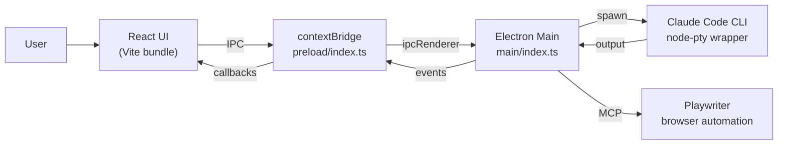
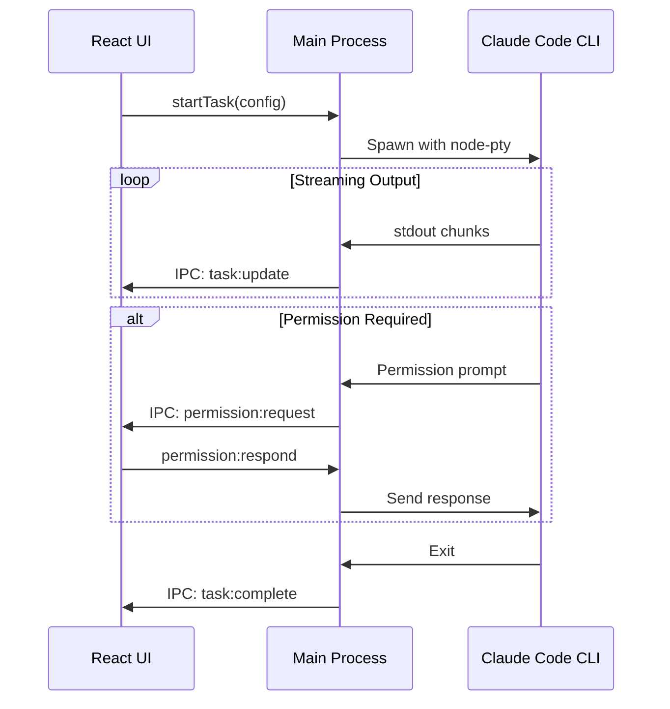

# Accomplish

Accomplish is a cross-platform desktop automation assistant. It ships an Electron app with a local React UI (bundled via Vite) that drives the Claude Code CLI to execute user-described tasks.

## Monorepo layout

```
apps/
  desktop/   # Electron main + preload + renderer
packages/
  shared/    # Shared TypeScript types
```

## Architecture overview

The desktop app uses a **local UI** pattern where:
- **Electron shell** (`apps/desktop`) hosts both native functionality and the UI
- **React UI** is bundled via Vite and loaded locally
- **Communication** happens through IPC between renderer and main process via `contextBridge`

### System map



### Desktop application (`apps/desktop`)

The Electron app is split into three cooperating processes:

- **Main process (`src/main`)**
  - Boots the app, enforces single-instance behavior
  - Exposes IPC handlers for task lifecycle, settings, onboarding, and API key management
  - Wraps the bundled Claude Code CLI via `node-pty`, streaming output and handling permissions
  - Persists app state via `electron-store` and API keys via encrypted storage
  - Manages Playwriter for browser automation via MCP

- **Preload (`src/preload`)**
  - Exposes a typed `window.accomplish` API via `contextBridge`
  - Keeps context isolation enabled for security

- **Renderer (`src/renderer`)**
  - React app bundled by Vite
  - Zustand for state management
  - Pages: Home, Execution, History, Settings

### Task Execution Flow



### Shared types (`packages/shared`)

TypeScript interfaces shared across the app to keep IPC payloads aligned.

## Getting started

### Prerequisites

- Node.js 20+
- pnpm 9+

### Install

```bash
pnpm install
```

### Development

```bash
pnpm dev              # Run desktop app in dev mode (Vite + Electron)
pnpm dev:clean        # Dev mode with clean start (clears stored data)
```

### Build

```bash
pnpm build            # Build all workspaces
pnpm build:desktop    # Build desktop app only
```

## Common scripts

| Command | Description |
|---------|-------------|
| `pnpm dev` | Start the desktop app in dev mode |
| `pnpm build` | Build all workspaces |
| `pnpm lint` | Run TypeScript checks |
| `pnpm typecheck` | Run type validation |
| `pnpm -F @accomplish/desktop test:e2e` | Run Playwright E2E tests |

## Environment Variables

| Variable | Description |
|----------|-------------|
| `CLEAN_START=1` | Clear all stored data on app start |
| `E2E_SKIP_AUTH=1` | Skip onboarding flow (for testing) |

## Use cases

- Automate browser workflows (travel booking, form filling, research)
- Handle spreadsheets and document workflows
- Organize files and automate repetitive desktop tasks
